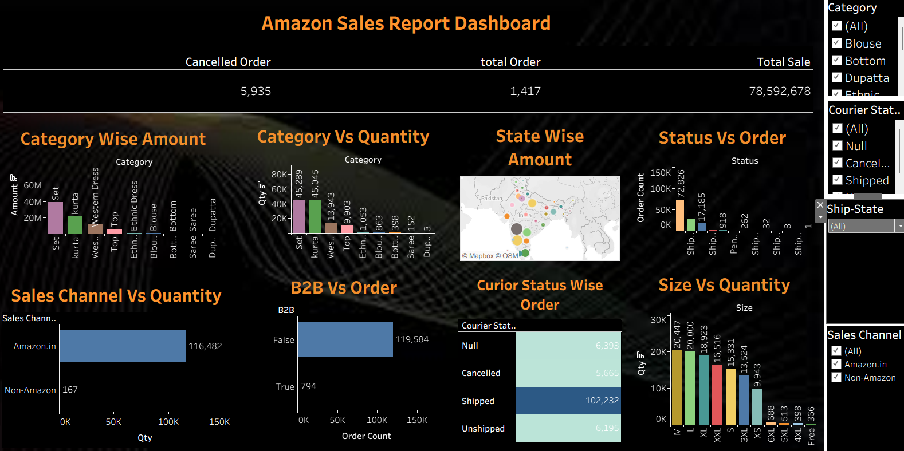

# Amazon Sales Analytics Dashboard | Tableau

## 📊 Project Overview

This project presents an interactive **Amazon Sales Analytics Dashboard** built using **Tableau**. The dashboard analyzes sales performance, profit, products, categories, regions, and sales trends to provide meaningful business insights and support data-driven decision-making.

## 🎯 Objectives

* Analyze overall sales and profit performance
* Identify top-performing products and categories
* Analyze regional sales performance
* Understand sales trends over time
* Identify profitable and underperforming areas
* Provide interactive business insights using Tableau

## 🛠️ Tools & Technologies

* **Tableau**
* **Microsoft Excel**
* **Data Cleaning & Transformation**
* **Data Visualization**
* **Calculated Fields**
* **Interactive Filters & Dashboards**

## 📈 Dashboard Features

* KPI cards for key business metrics
* Sales and profit analysis
* Sales trend analysis
* Category-wise performance
* Product-wise analysis
* Regional performance analysis
* Top-performing products
* Interactive filters and visualizations

## 📸 Dashboard Preview

## 💡 Key Insights

The dashboard helps identify:

* Overall sales and profit performance
* Top-performing products and categories
* Regions generating higher sales
* Sales trends over time
* Products and categories with stronger profitability
* Areas requiring business improvement

## 📂 Project File

The complete **Tableau project file** is included in this repository.

## 👩‍💻 Created By

**Sakshi Patil**

Aspiring Data Analyst | Power BI | Tableau | Excel | SQL | Python
